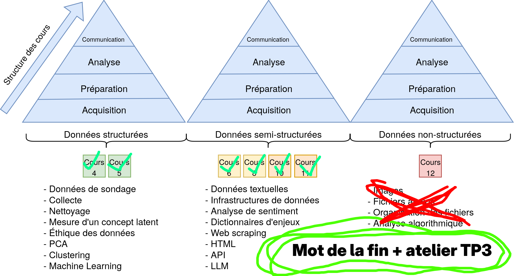
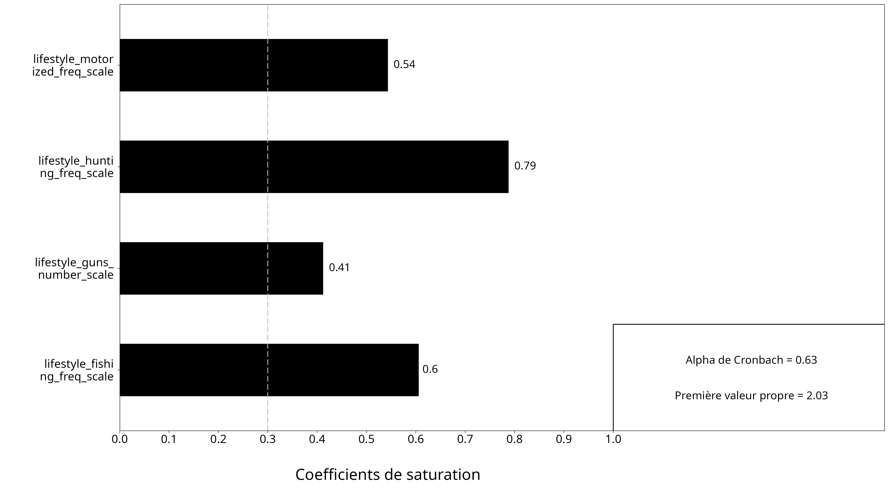
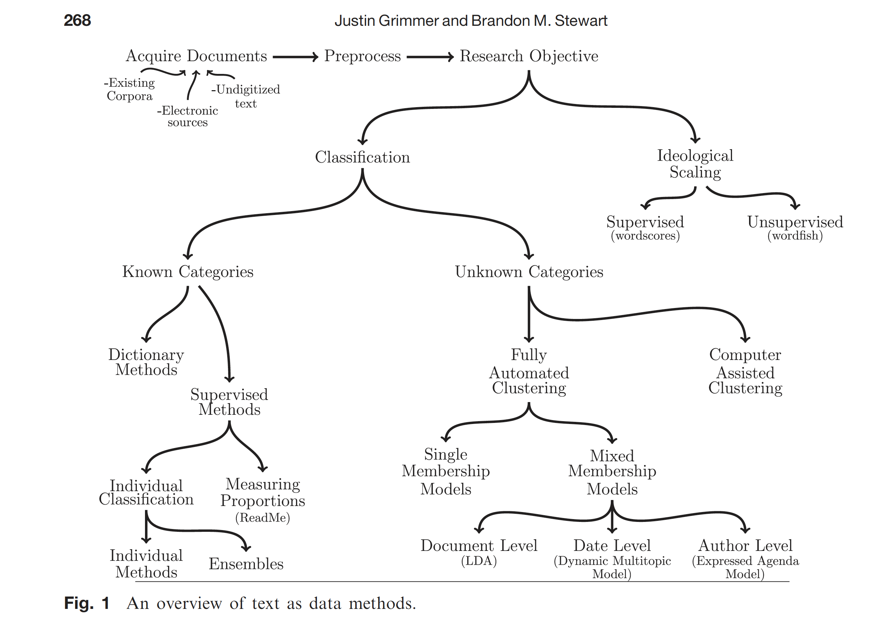
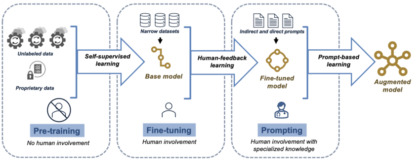

# Résumé de la session {background-color="#40666e"}

## Structure du cours

::: {.r-stack}

{.fragment}

:::

## Le parcours du semestre {.smaller}

1. **Introduction aux mégadonnées** : voir des traces numériques comme données de recherche
2. **Introduction à R** : objets, fonctions, graphiques et statistiques de base
3. **Terminal, Git, GitHub et Quarto** : travailler proprement et de façon reproductible
4. **Tidy data et sondages** : structurer, nettoyer, représenter et pondérer
5. **Mesures latentes** : construire de bons indicateurs pour des concepts abstraits
6. **Analyse textuelle** : pipeline, regex, dictionnaires et classification
7. **Web scraping** : naviguer, aspirer, extraire et nettoyer des données web
8. **LLM** : comprendre, utiliser et automatiser des tâches avec des API
9. **IA agentique** : faire agir un LLM avec des outils et des sources connectées

## Le fil conducteur du cours {.smaller}

:::: {.columns}

::: {.column width="50%"}

:::

::: {.column width="50%"}

Notre travail cette session a été de transformer des données produites pour d'autres fins en matériel de recherche exploitable.

- observer les données disponibles
- les structurer
- les nettoyer
- les analyser
- interpréter les résultats

:::

::::

# Fondations {background-color="#40666e"}

## La boîte à outils {.smaller}

:::: {.columns}

::: {.column width="50%"}

**Produire et analyser**

- `R`
- Positron
- packages du tidyverse
- visualisation et modèles simples

**Travailler proprement**

- terminal
- Git
- GitHub
- Quarto

:::

::: {.column width="50%"}

{width="35%"}

{width="90%"}

:::

::::

## Tidy data et cleaning {.smaller}

- Une variable par colonne
- Une observation par ligne
- Une unité d'analyse par tableau
- Standardiser le nettoyage rend l'analyse plus simple

# Données structurées {background-color="#40666e"}

## Sondages {.smaller}

- demander plutôt qu'observer
- formuler les questions avec soin
- penser à l'échantillonnage et à la non-réponse
- vérifier la représentativité
- pondérer lorsque l'échantillon s'écarte de la population

## Mesures latentes {.smaller}

:::: {.columns}

::: {.column width="55%"}

- plusieurs concepts importants ne sont pas directement observables
- il faut construire une échelle à partir de plusieurs indicateurs
- une bonne mesure doit être fiable et valide
- l'analyse factorielle aide à voir si les items tiennent ensemble

:::

::: {.column width="45%"}
{width="95%"}
:::

::::

# Données non structurées {background-color="#40666e"}

## Analyse textuelle {.smaller}

:::: {.columns}

::: {.column width="50%"}

- stopwords
- regex
- dictionnaires
- analyse de sentiment
- classification et résumé

:::

::: {.column width="50%"}

:::

::::

## Web scraping {.smaller}

:::: {.columns}

::: {.column width="55%"}

- comprendre la différence entre web et internet
- lire une URL
- distinguer HTML, JSON et APIs
- observer le code source et l'onglet réseau
- extraire, nettoyer puis organiser les données
:::

::: {.column width="45%"}

:::

::::

# IA et automatisation {background-color="#40666e"}

## Ce que sont les LLM {.smaller}

:::: {.columns}

::: {.column width="55%"}

- des modèles entraînés sur d'énormes volumes de texte
- utiles pour générer, transformer, classifier et résumer

**Mais**

- biais des données
- opacité partielle du raisonnement

:::

::: {.column width="45%"}

:::

::::

## Utiliser les LLM en recherche {.smaller}

1. Accéder aux modèles par API
2. Écrire un prompt clair
3. Faire travailler le modèle ligne par ligne sur un tableau
4. Automatiser avec des boucles
5. Sauvegarder progressivement les résultats
6. Vérifier les réponses critiques

## IA agentique {.smaller}

:::: {.columns}

::: {.column width="45%"}

Un LLM seul produit du texte.

Un agent combine:

- un objectif
- de l'autonomie
- des outils
- des actions observables

:::

::: {.column width="55%"}

:::

::::

## MCP {.smaller}

:::: {.columns}

::: {.column width="48%"}

- connecter des outils et des services au modèle
- aller chercher de l'information dans GitHub, Notion, Drive ou le terminal
- passer de la simple conversation à l'exécution de tâches
- ouvrir la porte à des workflows de recherche plus intégrés

:::

::: {.column width="52%"}
{width="100%"}
:::

::::

# Conclusion {background-color="#40666e"}

## Compétences acquises {.smaller}

::: {.columns}
::: {.column width="50%"}

**Compétences techniques**

- programmer en R
- nettoyer et restructurer des données
- faire des graphiques et des analyses de base
- utiliser GitHub et Quarto
- collecter des données via web scraping ou API

:::

::: {.column width="50%"}

**Compétences analytiques**

- traduire une question en stratégie empirique
- évaluer la qualité d'une mesure
- choisir une méthode adaptée au données disponible
- utiliser l'IA comme outil

:::
:::

## L'idée à retenir {.smaller}

Les outils vus cette session servent à une même chose:

- transformer des traces numériques en données
- transformer des données en analyse
- transformer une analyse en argument de recherche défendable

# Merci {.biggest}
