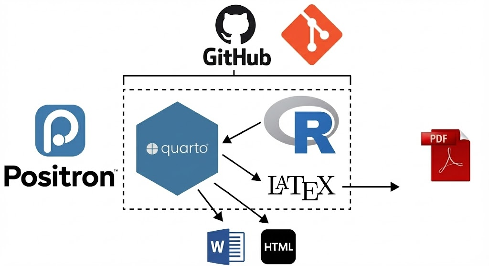

## Votre chargé de cours {.biggest}

- Laurence-Olivier M. Foisy
- Courriel: [mail@mfoisy.com](mailto:mail@mfoisy.com)
- Meilleure façon de me rejoindre: Slack
- Bureau: Aucun
- Université: Laval 

## Mon parcours en science des données {.smaller}

:::: {.columns}

::: {.column width="50%"}

:::

::: {.column width="50%"}

- Maitrise au Japon en études de la paix, 100% quali
- Arrivée au doctorat en 2023 
- Rencontre avec le directeur de la CLESSN
- Ouverture au monde de la science des données
- Participation à plusieurs projets de recherche

:::

::::

## Questions pour vous 

- Vos programmes d'études?
- Votre connaissance en R?
- Utilisez-vous l'IA générative?
- Votre connaissance en bases de données?
- Avez-vous déjà scrapé des données sur le web?
- Pourquoi avez-vous pris ce cours?

# Présentation du cours

## Qu'est-ce que des mégadonnées? {auto-animate=true}

### Les trois V ? 

- Volume
- Vélocité
- Variété

## Les trois V?

{.absolute width="50%" .fragment .fade-in}

## Les quatre V?

{.absolute width="80%" .fragment .fade-in}

## Les cinq V?

{.absolute width="100%" .fragment .fade-in}

## Les six V?

{.absolute width="60%" .fragment .fade-in}

## Les sept V?

{.absolute width="70%" .fragment .fade-in}

## Les huit V?

{.absolute width="50%" .fragment .fade-in}

## Les neuf V?

{.absolute width="60%" .fragment .fade-in}

## Les dix V?

{.absolute width="60%" .fragment .fade-in}

## Les onze V?

{.absolute width="40%" .fragment .fade-in}

## Les douze V?

{.absolute width="60%" .fragment .fade-in}

## Les treize V?

{.absolute width="60%" .fragment .fade-in}

## Les quatorze V?

{.absolute width="65%" .fragment .fade-in}

## Les quinze V?

{.absolute width="60%" .fragment .fade-in}

## Combien de "V" peut-on intégrer dans un concept ?{.biggest}

::: {.r-fit-text}
Réponse: 14!
:::

::: {.callout-important}
### La vraie question
Ce n'est pas "Combien de V?", mais "Comment utiliser ces données de façon responsable et pertinente?"
:::

## Une autre définition : Les 5W ? {auto-animate=true}

- Who?
- What?
- When?
- Where?
- Why?

## Une autre définition : Les 5W ? {auto-animate=true}

- Who?
- What?
- When?
- Where?

## Une autre définition : Les 5W ? {auto-animate=true}

- Why?

## Une autre définition : Les 5W ? {auto-animate=true}

- Pourquoi ?
  - Faire de la science ?
  - Comprendre le monde qui nous entoure ?
  - Prendre des décisions éclairées ?
  - Parce que c'est le fun?

## Quel jeu de donnée donne les meilleurs résultats ? {auto-animate=true}

- Sondage de 1000 participants représentatif?
- 2M de commentaires facebook?

## Quel jeu de donnée donne les meilleurs résultats ? {auto-animate=true}

Ça dépend de la question de recherche!

- Quel est l'acceptabilité sociale du kidnaping de Maduro par les États-Unis?

- Quel est l'effet de conduire un camion ou une voiture électrique sur les intentions de vote? 

## Avant et maintenant {.smaller}

**Avant**: On créait des données spécifiquement pour répondre à une question de recherche.

**Maintenant**: On utilise des données déjà existantes pour répondre à une question de recherche.

L'un n'est pas mieux que l'autre. Ils répondent à des besoins différents.

## Des données du quotidien deviennent des données de recherche {.smaller}

:::: {.columns}

::: {.column width="50%"}
**Données originales**

- Discussions Reddit
- Cartes de chaleur Strava
- Playlists Spotify
- Profils LinkedIn
- Tendances TikTok
:::

::: {.column width="50%"}
**Questions de recherche**

- Opinion publique sur l'IA?
- Mobilité urbaine post-pandémie?
- Identités culturelles générationnelles?
- Trajectoires professionnelles genrées?
- Diffusion des mouvements sociaux?
:::

::::

:::{.callout-important}
Le but de ce cours est de vous apprendre à voir des données du quotidien comme des données de recherche potentielles.
:::

## Le principe fondamental des big data

### Reconversion

:::: {.columns}

::: {.column width="50%"}

:::

::: {.column width="50%"}
Notre travail

{.absolute top=200 right=0 width="40%"}

:::
::::

## Structure du cours

## Objectifs

- Avoir une connaissance globale des différentes sources de données disponibles pour étudier les phénomènes sociaux.

- Développer l’autonomie nécessaire pour collecter, gérer et analyser quantitativement des bases de données, et les intégrer dans un projet de recherche.

- Démontrer une compréhension des enjeux liés à la mobilisation et à l’utilisation de grandes bases de données en sciences sociales.

## Les outils pour y arriver {.smaller}

## Évaluations {.smaller}

| Évaluations                     |Points   | Dates                        |
|---------------------------------|---------|------------------------------|
| TP1 - Introduction              | 10%     | 28 janvier 2026 avant minuit |
| Quiz 1                          | 15%     | 5 février 2026               |
| TP2 - Travail de mi-session     | 20%     | 11 mars 2026 avant minuit    |
| Quiz 2                          | 15%     | 9 avril 2026                 |
| TP3 - Travail de session        | 30%     | 30 avril 2026 avant minuit   |
| Participation en classe         | 10%     | 8 janvier au 30 avril        |
| Total                           | 100%    | 8 janvier au 30 avril        |

## Site du cours

Le site web du cours est disponible au [https://fas1001.com](https://fas1001.com).
Toutes les informations concernant le cours y seront publiées, y compris les diapositives, les travaux pratiques, les quiz, le plan de cours et les dates importantes.

## En rafale: {.smaller}

- ChatGPT?
- Règles de retard: 10% par jour
- Matériel requis
- Vous avez des questions? Posez-les!
- Vous avez des commentaires? Partagez-les!
- Vous avez des suggestions? Proposez-les!

# Bonne session!
