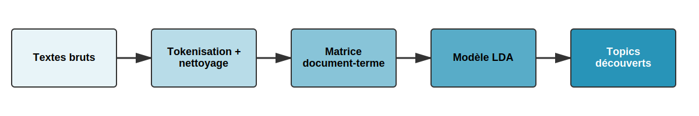

# Retour sur le Quiz1 {.smaller}

- Utiliser GitHub pour sauvegarder vos fichiers
- Comment retourner sur GitHub pour voir l'ancienne version de votre TP1
- Faire table() avant et après
- Éviter de mettre les citations en texte
- Ne laissez pas de code inutile

## Utiliser les citations en markdown {.smaller}

### La mauvaise façon :x:

```markdown
Selon Wickham (2014) [@wickham14], les tidy data ont trois propriétés.
```
Selon Wickham (2014) (Wickham, 2014), les tidy data ont trois propriétés.

### Les deux options :white_check_mark:
```markdown
Selon @wickham14, les tidy data ont trois propriétés.
```
Selon Wickham (2014), les tidy data ont trois propriétés:

```markdown
Les tidy data ont trois propriétés [@wickham14].
```
Les tidy data ont trois propriétés (Wickham, 2014).

## Ne pas laisser de code inutile {.smaller}

Utiliser l'historique GitHub pour voir les changements


## TP2 - Travail de mi-session {.smaller}

- À remettre le 11 mars 2025 avant minuit
- 20% de la note finale

## {transition="none"}


## {transition="none"}


## Gabarit suggéré {.smaller}

1. Introduction
2. Question de recherche
3. Revue de littérature 
4. Hypothèses dérivées de la littérature
5. Données et méthodologies
6. Résultats
7. Discussion
8. Conclusion

# Introduction à l'analyse textuelle

## Structure du cours

::: {.r-stack}


{.fragment}

:::

## Pourquoi analyser du texte?

### Les données sont partout :earth_americas: :earth_africa: :earth_asia:

- Données textuelles disponibles en grande quantité
- Méthodes de recherche de plus en plus accessibles
- Idée(s) sur différentes sources de données textuelles? 

## {background-image="img/newspapers.webp" background-size="cover"}

## {background-image="img/assnat.avif" background-size="cover"}

## L'explosion des données textuelles

- Médias sociaux
- Articles de presse
  - [Eureka et Factiva](https://bib.umontreal.ca/guides/types-documents/journaux)
- Documents légaux
- Sondages (questions ouvertes)
- Courriels
- Messages instantanés
- Beaucoup plus

## Que peut-on faire avec le texte?

1. Analyse de sentiment 
2. Classification de documents 
3. Extraction de thèmes 
4. Résumé automatique 
5. Analyse de discours 

## Différentes méthodes d'analyse textuelle


# Le pipeline de traitement textuel

##

{width=100% fig-alt="Pipeline de traitement du langage naturel"}

## Tokenisation

### Découper le texte en mots

```
"J'aime analyser du texte"
      ↓
["J'", "aime", "analyser", "du", "texte"]
```

## Stopwords (mots vides)

### Quoi retirer?

**Français** : le, la, de, et, un, dans, est...

**Anglais** : the, a, an, in, on, at, is...

## Avant et après

::::{.columns}

:::{.column width="50%"}

### Avant
```
le chat est sur le tapis
```
6 mots

:::

:::{.column width="50%"}

### Après
```
chat tapis
```
2 mots significatifs

:::

::::

# Introduction aux expressions régulières

## Qu'est-ce qu'on essaie de faire?

- Trouver des patterns dans du texte
- Exemple : Trouver tous les numéros de téléphone dans un document
- Exemple : Extraire tous les courriels d'un texte

## Un exemple concret

Imaginons que vous ayez ce texte:

```text
Contact: Marie (514-555-1234) 
Courriel: marie@udem.ca
Contact: Pierre (438-555-5678)
Courriel: pierre@udem.ca
```

Comment trouver automatiquement tous les numéros de téléphone?

## La solution "manuelle"

1. Chercher des chiffres
2. Regroupés par 3 ou 4
3. Séparés par des tirets
4. Commençant par 514 ou 438

## La solution avec regex

```r
# Un pattern qui trouve les numéros de téléphone
"\\d{3}-\\d{3}-\\d{4}"
```

## Décomposons le pattern

- `\d` : un chiffre (0-9)
- `{3}` : exactement 3 fois
- `-` : un tiret
- Donc `\d{3}-\d{3}-\d{4}` trouve: "514-555-1234"

## Un deuxième exemple : Les courriels

Reprenons le même texte:

```text
Contact: Marie (514-555-1234)
Courriel: marie@udem.ca
Contact: Pierre (438-555-5678)
Courriel: pierre@udem.ca
```

Comment trouver automatiquement toutes les adresses courriel?

## La solution "manuelle"

1. Chercher des lettres
2. Suivies d'un symbole @
3. Suivies du nom de domaine
4. Terminant par .ca, .com, etc.

## La solution avec regex

```r
# Un pattern qui trouve les adresses courriel
"[a-zA-Z0-9._%+-]+@[a-zA-Z0-9.-]+\\.[a-zA-Z]{2,}"
```

## Décomposons le pattern

- `[a-zA-Z0-9._%+-]+` : lettres, chiffres et caractères spéciaux (avant @)
- `@` : le symbole @
- `[a-zA-Z0-9.-]+` : lettres, chiffres, points et tirets (nom de domaine)
- `\\.` : un point (échappé avec \\)
- `[a-zA-Z]{2,}` : au moins 2 lettres (.ca, .com, .info, etc.)
- Donc ce pattern trouve: "marie@udem.ca" et "jean.dupont@umontreal.ca"

## Pourquoi c'est utile?

- Automatise la recherche de patterns
- Fonctionne sur n'importe quelle quantité de texte
- Plus rapide et fiable que la recherche manuelle
- Essentiel pour le nettoyage de données textuelles

## Utilisation dans R

### Le package stringr

```r
# Installation si nécessaire
install.packages("stringr")

# Chargement
library(stringr)
```

- Fait partie du tidyverse
- Fonctions simples et cohérentes
- Documentation claire avec de nombreux exemples

## Fonctions principales de stringr

```r
# Détecter un pattern
str_detect(string, pattern)

# Extraire un pattern
str_extract(string, pattern)

# Remplacer un pattern
str_replace(string, pattern, replacement)

# Séparer selon un pattern
str_split(string, pattern)
```

## Exemple pratique

```r
library(stringr)

# Notre texte
text <- "Contact: Marie (514-555-1234), Pierre (438-555-5678)"

# Trouver tous les numéros
numeros <- str_extract_all(text, "\\d{3}-\\d{3}-\\d{4}")

# Résultat
print(numeros)
# [[1]]
# [1] "514-555-1234" "438-555-5678"
```

## Les briques de base des regex{.smaller}

### `\d` : Chiffres

```r
texte <- "Je suis né en 1990 et j'ai 33 ans"
str_extract_all(texte, "\\d+")
# Résultat: [1] "1990" "33"
```

### `[A-Z]` : Lettres majuscules

```r
texte <- "QUÉBEC est une ville du Canada"
str_extract(texte, "[A-Z]+")
# Résultat: "QUÉBEC"
```

### `\s` : Espaces

```r
texte <- "mot     clé"
str_replace_all(texte, "\\s+", " ")
# Résultat: "mot clé"
```

## Caractères spéciaux {.smaller}

### `\w` : Mot (lettres + chiffres + _)

```r
texte <- "user_123 a posté!"
str_extract_all(texte, "\\w+")
# Résultat: [1] "user_123" "a" "posté"
```

### `.` : N'importe quel caractère

```r
texte <- "chat, chut, chit"
str_extract_all(texte, "ch.t")
# Résultat: [1] "chat" "chut" "chit"
```

## Cas d'usage pour l'analyse textuelle {.smaller}

### Retirer les URLs d'un texte

```r
texte <- "Visitez https://www.umontreal.ca ou https://pol2k.github.io/ pour plus d'infos"
texte_propre <- str_remove_all(texte, "https?://[\\w\\./]+")
# Résultat: "Visitez  ou  pour plus d'infos"
```

### Extraire les hashtags

```r
tweet <- "Super soirée! Merci @JeanDupont #Montreal #UdeM"
hashtags <- str_extract_all(tweet, "#\\w+")
# Résultat: [1] "#Montreal" "#UdeM"
```

### Normaliser les dates

```r
texte <- "Rendez-vous le 2025-01-15 ou le 15/01/2025"
dates <- str_extract_all(texte, "\\d{4}-\\d{2}-\\d{2}|\\d{2}/\\d{2}/\\d{4}")
# Résultat: [1] "2025-01-15" "15/01/2025"
```

## Les quantificateurs : Combien de fois?{.smaller}

### Le `+` : "un ou plusieurs"
```r
# Trouver les nombres (un ou plusieurs chiffres)
texte <- "J'ai 1 chat et 22 poissons"
str_extract_all(texte, "\\d+")
# Résultat: [1] "1" "22"
```

### Le `*` : "zéro ou plusieurs"
```r
# Trouver les mots avec ou sans 's' à la fin
texte <- "chat chats chien chiens"
str_extract_all(texte, "chat[s]*")
# Résultat: [1] "chat" "chats"
```

### Le `?` : "optionnel (zéro ou un)"
```r
# Trouver 'behaviour' ou 'behavior'
texte <- "behaviour and behavior"
str_extract_all(texte, "behaviou?r")
# Résultat: [1] "behaviour" "behavior"
```

## Exemples pratiques pour les sciences sociales{.smaller}

### Extraire des codes postaux canadiens
```r
adresse <- "Mon adresse est H2X 1Y6"
str_extract(adresse, "[A-Z]\\d[A-Z]\\s?\\d[A-Z]\\d")
# Résultat: "H2X 1Y6"
```

### Extraire des identifiants Twitter
```r
tweet <- "Suivez-moi @MonProfR et @UdeM"
str_extract_all(tweet, "@\\w+")
# Résultat: [1] "@MonProfR" "@UdeM"
```

### Extraire des pourcentages
```r
texte <- "Le taux de participation est de 67.5% et l'appui à 82%"
str_extract_all(texte, "\\d+\\.?\\d*%")
# Résultat: [1] "67.5%" "82%"
```

## Comment utiliser les regex en R?

:::: {.columns}

::: {.column width="40%"}

1. Les numéros de téléphone?
2. Les adresses courriel?
3. Les pourcentages?

**L'intelligence artificielle :wink:**

:::

::: {.column width="65%"}

{.absolute top=100 left=600 width=50%}
:::

::::

# Analyse de sentiment

## Analyse par dictionnaire

### Le principe

Attribuer un score à chaque mot selon sa connotation émotionnelle

| Mot | Score |
|-----|-------|
| excellent | +3 |
| bon | +1 |
| mauvais | -1 |
| horrible | -3 |

Le score du texte = somme ou moyenne des scores

## Qu'est-ce qu'un dictionnaire de sentiment? {.smaller}

### Une liste de mots avec des scores prédéfinis

- Créé manuellement par des experts
- Chaque mot associé à un score (positif/négatif)

### Avantages

- Rapide et reproductible
- Pas besoin d'entraînement

## Dictionnaires populaires {.smaller}

| Dictionnaire | Langue | Type de score | Utilisation |
|--------------|--------|---------------|-------------|
| **AFINN** | EN | -5 à +5 | Médias sociaux, avis |
| **Bing** | EN | Pos/Neg | Analyses générales |
| **NRC** | EN/FR | 8 émotions | Analyse émotionnelle |
| **Lexicoder** | EN/FR | Binaire | Textes politiques |
| **VADER** | EN | -1 à +1 | Twitter, slang |

## Le dictionnaire AFINN {.smaller}

### Créé par Finn Årup Nielsen (2011)

- 2,477 mots en anglais
- Scores de -5 (très négatif) à +5 (très positif)
- Optimisé pour les textes courts (Twitter, avis)
- Inclut du vocabulaire informel

### Exemples

| Mot | Score | Mot | Score |
|-----|-------|-----|-------|
| love | +3 | hate | -3 |
| excellent | +3 | terrible | -3 |
| good | +3 | bad | -3 |
| disappointed | -2 | recommend | +2 |

## Analyse avec AFINN : La ligne rouge {transition="none"}


::: {.columns}

::: {.column width="60%"}

> Super good kebab! The portions are generous, the prices are really reasonable, and the quality is there. Tasty meat, fresh bread, and everything is well seasoned. An excellent address for a meal that is good without breaking the bank. I recommend!

:::

::: {.column width="40%"}

- Sentiment: Positif
- Thèmes: Nourriture, Prix
- Note: 5/5

:::

::::

##

{width=100% fig-alt="Pipeline de traitement du langage naturel"}


## Étape 1: Texte brut {transition="none"}

```r
# Créer un data.frame avec notre review
review <- data.frame(
  restaurant = "La ligne rouge",
  text = "Super good kebab! The portions are generous, the prices are really reasonable, and the quality is there. Tasty meat, fresh bread, and everything is well seasoned. An excellent address for a meal that is good without breaking the bank. I recommend!",
  stringsAsFactors = FALSE
)
```

### Donne un dataframe comme ceci


| restaurant      | text                    |
|-----------------|-------------------------|
| La ligne rouge  | Super good kebab! [...] |


## Étape 2: Nettoyage {transition="none"}
```r
# Nettoyage avec stringr
review_clean <- review
review_clean$text <- stringr::str_to_lower(review_clean$text)                 # Minuscules
review_clean$text <- stringr::str_remove_all(review_clean$text, "!")          # Exclamations
review_clean$text <- stringr::str_remove_all(review_clean$text, "\\.")        # Points
review_clean$text <- stringr::str_remove_all(review_clean$text, ",")          # Virgules
```

::: {.columns}
::: {.column width="100%"}
> <span style="color:#880808">S</span>uper good kebab<span style="color:#880808">!</span> <span style="color:#880808">T</span>he portions are generous<span style="color:#880808">,</span> the prices are really reasonable<span style="color:#880808">,</span> and the quality is there<span style="color:#880808">.</span> <span style="color:#880808">T</span>asty meat<span style="color:#880808">,</span> fresh bread<span style="color:#880808">,</span> and everything is well seasoned<span style="color:#880808">.</span> <span style="color:#880808">A</span>n excellent address for a meal that is good without breaking the bank<span style="color:#880808">.</span> <span style="color:#880808">I</span> recommend<span style="color:#880808">!</span>
:::
:::

## Étape 2: Nettoyage {transition="none"}
```r
# Nettoyage avec stringr
review_clean <- review
review_clean$text <- stringr::str_to_lower(review_clean$text)                 # Minuscules
review_clean$text <- stringr::str_remove_all(review_clean$text, "!")          # Exclamations
review_clean$text <- stringr::str_remove_all(review_clean$text, "\\.")        # Points
review_clean$text <- stringr::str_remove_all(review_clean$text, ",")          # Virgules
```

::: {.columns}
::: {.column width="100%"}
> super good kebab the portions are generous the prices are really reasonable and the quality is there tasty meat fresh bread and everything is well seasoned an excellent address for a meal that is good without breaking the bank i recommend
:::
:::

## Étape 3: Tokenisation {transition="none"}


:::: {.columns}

::: {.column width="60%"}

```r
tokens <- tidytext::unnest_tokens(
  review_clean,
  output = word,
  input = text
)

```
:::

::: {.column width="40%"}


```
r$> head(tokens, 10)
       restaurant     word
1  La ligne rouge    super
2  La ligne rouge     good
3  La ligne rouge    kebab
4  La ligne rouge      the
5  La ligne rouge portions
6  La ligne rouge      are
7  La ligne rouge generous
8  La ligne rouge      the
9  La ligne rouge   prices
10 La ligne rouge      are
```

:::

::::

## Étape 4: Retrait des mots vides {transition="none"}


:::: {.columns}

::: {.column width="60%"}

```r
# Obtenir les stop words
stop_words <- tidytext::get_stopwords(language = "en")

# Retirer les stop words avec dplyr anti_join
tokens_clean <- dplyr::anti_join(
  tokens, 
  stop_words,
  by = "word"
)

```

:::

::: {.column width="40%"}

```
r$> head(tokens_clean, 10)
       restaurant       word
1  La ligne rouge      super
2  La ligne rouge       good
3  La ligne rouge      kebab
4  La ligne rouge   portions
5  La ligne rouge   generous
6  La ligne rouge     prices
7  La ligne rouge     really
8  La ligne rouge reasonable
9  La ligne rouge    quality
10 La ligne rouge      tasty
```

:::

::::

## Étape 5: Analyse (AFINN) {transition="none"}


::: {.columns}

::: {.column width="70%"}

```r
# Obtenir le lexique AFINN
afinn <- tidytext::get_sentiments("afinn")

# Joindre avec nos tokens
sentiment_scores <- dplyr::inner_join(
  tokens_clean,
  afinn,
  by = "word"
)

# Voir les scores
arranged_scores <- sentiment_scores %>%
  dplyr::select(word, value) %>%
  dplyr::arrange(dplyr::desc(value))
```

:::

::: {.column width="30%"}

```
r$> head(arranged_scores, 10)
       word value
1     super     3
2      good     3
3 excellent     3
4      good     3
5  generous     2
6 recommend     2
7     fresh     1
```

:::

::::

## Étape 5: Analyse (AFINN) {transition="none"}

```r
total_sentiment <- dplyr::summarise(
  sentiment_scores,
  n_words = dplyr::n(),
  total_score = sum(value),
  avg_score = mean(value)
)

```

```
r$> total_sentiment
  n_words total_score avg_score
1       7          17  2.428571
```

## Avec plusieurs textes {.smaller transition="none"}

> Nothing exceptional, just edible. I had good feedback about the food and I was very, very disappointed. Not to mention cash only which for me is unacceptable. Too many good restaurants in the neighborhood, I won't go back there

> Food is good and price is ok. The only issu is the attitude of the staff. The lady at he cash register and the guy that takes the orders seriously lack client service skills. Both are  very rude. Hygiene is another issue, there are flies all over the place. In addition to all this, they only take cash.


```r
# Créer un data.frame avec plusieurs reviews
reviews <- data.frame(
  restaurant = "La ligne rouge",
  text = c(
    "Super good kebab! The portions are generous, the prices are really reasonable, and the quality is there. Tasty meat, fresh bread, and everything is well seasoned. An excellent address for a meal that is good without breaking the bank. I recommend!",
    "Nothing exceptional, just edible. I had good feedback about the food and I was very, very disappointed. Not to mention cash only which for me is unacceptable. Too many good restaurants in the neighborhood, I won't go back there",
    "Food is good and price is ok. The only issu is the attitude of the staff. The lady at he cash register and the guy that takes the orders seriously lack client service skills. Both are very rude. Hygiene is another issue, there are flies all over the place. In addition to all this, they only take cash."
  ),
  stringsAsFactors = FALSE
) %>%
  dplyr::mutate(id = 1:nrow(.))
```

## Nettoyage des multiples textes {transition="none"}


```r
reviews_clean <- reviews
reviews_clean$text <- stringr::str_to_lower(reviews_clean$text)                 # Minuscules
reviews_clean$text <- stringr::str_remove_all(reviews_clean$text, "!")          # Exclamations
reviews_clean$text <- stringr::str_remove_all(reviews_clean$text, "\\.")        # Points
reviews_clean$text <- stringr::str_remove_all(reviews_clean$text, ",")          # Virgules

```

## Étape 3: Tokenisation {transition="none"}


::::{.columns}

:::{.column width="60%"}

```r
tokens <- tidytext::unnest_tokens(
  reviews_clean,
  output = word,
  input = text
)

```
:::

:::{.column width="40%"}
```
r$> head(tokens, 10)
       restaurant id     word
1  La ligne rouge  1    super
2  La ligne rouge  1     good
3  La ligne rouge  1    kebab
4  La ligne rouge  1      the
5  La ligne rouge  1 portions
6  La ligne rouge  1      are
7  La ligne rouge  1 generous
8  La ligne rouge  1      the
9  La ligne rouge  1   prices
10 La ligne rouge  1      are
```
:::

::::

## Étape 4: Retrait des mots vides {transition="none"}


::::{.columns}

:::{.column width="60%"}

```r
# Obtenir les stop words
stop_words <- tidytext::get_stopwords(language = "en")

# Retirer les stop words avec dplyr anti_join
tokens_clean <- dplyr::anti_join(
  tokens, 
  stop_words,
  by = "word"
)

```
:::

:::{.column width="40%"}
```
r$> head(tokens_clean, 10)
       restaurant id       word
1  La ligne rouge  1      super
2  La ligne rouge  1       good
3  La ligne rouge  1      kebab
4  La ligne rouge  1   portions
5  La ligne rouge  1   generous
6  La ligne rouge  1     prices
7  La ligne rouge  1     really
8  La ligne rouge  1 reasonable
9  La ligne rouge  1    quality
10 La ligne rouge  1      tasty
```
:::

::::


## Étape 5: Analyse de sentiment (AFINN) {transition="none"}


::::{.columns}

:::{.column width="50%"}

```r
# Obtenir le lexique AFINN
afinn <- tidytext::get_sentiments("afinn")

# Joindre avec nos tokens
sentiment_scores <- dplyr::inner_join(
  tokens_clean,
  afinn,
  by = "word"
)

```

:::

:::{.column width="50%"}

```
r$> head(sentiment_scores, 10)
       restaurant id         word value
1  La ligne rouge  1        super     3
2  La ligne rouge  1         good     3
3  La ligne rouge  1     generous     2
4  La ligne rouge  1        fresh     1
5  La ligne rouge  1    excellent     3
6  La ligne rouge  1         good     3
7  La ligne rouge  1    recommend     2
8  La ligne rouge  2         good     3
9  La ligne rouge  2 disappointed    -2
10 La ligne rouge  2 unacceptable    -2
```

:::

::::

## Étape 5: Analyse de sentiment (AFINN) {transition="none" .smaller}


```r
# Calculate summary statistics per review
sentiment_summary <- sentiment_scores %>%
  group_by(id, restaurant) %>%
  summarise(
    total_sentiment = sum(value),            # Sum of all sentiment scores
    mean_sentiment = mean(value),            # Average sentiment
    word_count = n(),                        # Number of sentiment words
    min_sentiment = min(value),              # Most negative word
    max_sentiment = max(value)               # Most positive word
  ) %>%
  ungroup()

```

### Voici les résultats


```
r$> print(sentiment_summary)
# A tibble: 3 × 7
     id restaurant     total_sentiment mean_sentiment word_count min_sentiment max_sentiment
  <int> <chr>                    <dbl>          <dbl>      <int>         <dbl>         <dbl>
1     1 La ligne rouge              17           2.43          7             1             3
2     2 La ligne rouge               2           0.5           4            -2             3
3     3 La ligne rouge               1           0.5           2            -2             3
```


## Réassembler les données{.smaller transition="none"}

```r
# First, let's create a dataframe with just id and text
original_texts <- reviews %>%
  select(id, text)

# Then merge it with your sentiment summary
sentiment_summary_with_text <- sentiment_summary %>%
  left_join(original_texts, by = "id")
```
### En réunissant le text original avec les analyses:

```
r$> sentiment_summary_with_text
# A tibble: 3 × 8
     id restaurant     total_sentiment mean_sentiment word_count [..] text                                                   
  <int> <chr>                    <dbl>          <dbl>      <int> [..] <chr>                                                  
1     1 La ligne rouge              17           2.43          7 [..] Super good kebab! [...]
2     2 La ligne rouge               2           0.5           4 [..] Nothing exceptional [...]
3     3 La ligne rouge               1           0.5           2 [..] Food is good and price is ok. [...]

```

## Conseils pratiques 

1. **Validation**
   - Vérifier manuellement les résultats
   - Comparer les dictionnaires
   - Documenter les choix méthodologiques

2. **Limites**
   - Aucun dictionnaire n'est parfait
   - Contexte est toujours important
   - Valider avec analyses qualitatives

## Quel lexique choisir? {.smaller}

| Lexique | Type de score | Forces | Utilisation idéale | Discipline |
|---------|---------------|---------|-------------------|------------|
| AFINN | -5 à +5 | Nuancé, simple | Médias sociaux, avis | Marketing |
| BING | Pos/Neg | Simple, précis | Analyses générales | Sciences sociales |
| NRC | 8 émotions | Riche en contexte | Analyse émotionnelle | Psychologie |
| Lexicoder | Binaire + thèmes | Validé académiquement | Discours politiques | Science politique |
| VADER | -1 à +1 | Gère emojis/web | Médias sociaux | Communications |

## Limites de l'analyse de sentiment {.smaller}

::::{.columns}

:::{.column width="50%"}

### Problèmes linguistiques

- Ironie : "Super, encore un retard..."
- Expressions idiomatiques : "J'ai mon voyage"
- Contexte culturel : "Sick" = malade ou cool?
- Négations complexes : "Not bad at all, pas pire pantoute"

:::

:::{.column width="50%"}

### Limites techniques

- Dépendance au dictionnaire
- Mots ambigus
- Agrégation qui cache les nuances
- Évolution du langage

:::


::::

## Quand ne PAS utiliser

- Textes très courts (< 5 mots)
- Vocabulaire très spécialisé
- Forte présence d'ironie/sarcasme

## Bonnes pratiques

1. Valider manuellement un échantillon
2. Utiliser plusieurs dictionnaires
3. Analyser par segments
4. Documenter vos choix
5. Reconnaître les limites

## LDA : Allocation de Dirichlet Latente {transition="none"}

:::: {.columns}
::: {.column width="60%"}
### Qu'est-ce que c'est?
- Une méthode pour **découvrir automatiquement** des thèmes dans une collection de textes
- Développée en 2003 (Blei, Ng, Jordan)
- **Apprentissage non supervisé** : l'algorithme découvre seul les structures
:::

::: {.column width="40%"}

:::
::::

## L'intuition derrière LDA {transition="none"}

### L'idée centrale
- Chaque **document** contient plusieurs **sujets**
- Chaque **sujet** est une collection de **mots** liés
- Les mots apparaissent avec différentes **probabilités** dans chaque sujet

## Comment fonctionne LDA? {transition="fade"}

### Approche non supervisée
1. **Aucune connaissance préalable**
   - Pas de liste de mots prédéfinie
   - Pas d'étiquettes nécessaires
   
2. **Découverte automatique**
   - Les relations entre mots émergent des données
   - Les thèmes se forment naturellement

## Le processus en pratique {transition="none"}

### Étapes simplifiées
1. Transformer les textes en chiffres
2. Commencer par des assignations aléatoires
3. Répéter des milliers de fois:
   - Pour chaque mot: quel sujet est le plus probable?
   - Mettre à jour les distributions
4. Aboutir à des groupes cohérents

## Avantages pour les sciences sociales {transition="none"}

### Pourquoi utiliser LDA en sciences sociales?

1. **Analyse de grandes quantités de texte** (discours politiques, médias sociaux)
2. **Découverte objective de thèmes** sans biais d'interprétation préalable
3. **Suivi de l'évolution des discours** dans le temps
4. **Combinaison possible avec l'analyse de sentiment**

## Limites à connaître

- Nombre de sujets (k) à définir à l'avance
- Les sujets nécessitent une interprétation humaine
- Besoin d'un volume suffisant de données

## Le processus LDA en 4 étapes



## Modélisation de sujets (Topic Modeling) {transition="none"}

```r
# Chargement des bibliothèques
library(tidytext)
library(tidyr)
library(dplyr)
library(ggplot2)
library(topicmodels)

# Charger les exemples de reviews de restaurants
reviews <- data.frame(
  restaurant = "La ligne rouge",
  text = c(
    "Super good kebab! The portions are generous, the prices are really reasonable, and the quality is there. Tasty meat, fresh bread, and everything is well seasoned. An excellent address for a meal that is good without breaking the bank. I recommend!",
    "Nothing exceptional, just edible. I had good feedback about the food and I was very, very disappointed. Not to mention cash only which for me is unacceptable. Too many good restaurants in the neighborhood, I won't go back there",
    "Food is good and price is ok. The only issu is the attitude of the staff. The lady at he cash register and the guy that takes the orders seriously lack client service skills. Both are very rude. Hygiene is another issue, there are flies all over the place. In addition to all this, they only take cash."
  ),
  stringsAsFactors = FALSE
) %>%
  dplyr::mutate(id = 1:nrow(.))
```

## Création de la matrice document-terme {transition="none"}

```r
reviews_dtm <- reviews %>%
  mutate(doc_id = paste0("doc_", id)) %>%
  tidytext::unnest_tokens(word, text) %>%
  anti_join(stop_words) %>% # Supprimer les mots vides
  count(doc_id, word) %>%
  cast_dtm(doc_id, word, n)

# Afficher un aperçu de la matrice
reviews_dtm
```

```
<<DocumentTermMatrix (documents: 3, terms: 71)>>
Non-/sparse entries: 77/136
Sparsity           : 64%
Maximal term length: 11
Weighting          : term frequency (tf)
Sample             :
      Terms
Docs   food good price quality
  doc_1    0    2     0       1
  doc_2    1    1     0       0
  doc_3    1    1     1       0
```

## Application du modèle LDA {transition="none"}

```r
# Exécuter le modèle LDA
set.seed(123) # Pour la reproductibilité
lda_model <- LDA(reviews_dtm, k = 2, control = list(seed = 123, verbose = TRUE))

# Examiner la distribution des sujets pour chaque document
topics <- tidy(lda_model, matrix = "gamma")
topics_wide <- topics %>%
  pivot_wider(names_from = topic, values_from = gamma)

print(topics_wide)
```

```
# A tibble: 3 × 3
  document   `1`   `2`
  <chr>    <dbl> <dbl>
1 doc_1    0.692 0.308
2 doc_2    0.333 0.667
3 doc_3    0.391 0.609
```

## Extraction des termes principaux pour chaque sujet {transition="none"}

:::: {.columns}

::: {.column width="50%"}

```r
# Extraire les termes principaux de chaque sujet
top_terms <- tidy(lda_model, matrix = "beta") %>%
  group_by(topic) %>%
  slice_max(beta, n = 10) %>%
  arrange(topic, -beta)

# Afficher les termes principaux pour chaque sujet
print(top_terms)
```

:::

::: {.column width="50%"}

```
r$> print(top_terms)
# A tibble: 20 × 3
# Groups:   topic [2]
   topic term           beta
   <int> <chr>         <dbl>
 1     1 portions     0.0384
 2     1 hygiene      0.0381
 3     1 takes        0.0374
 4     1 seasoned     0.0366
 5     1 recommend    0.0364
 6     1 lady         0.0352
 7     1 disappointed 0.0334
 8     1 client       0.0333
 9     1 super        0.0328
10     1 address      0.0321
11     2 cash         0.113 
12     2 food         0.0600
13     2 bank         0.0390
14     2 meal         0.0389
15     2 feedback     0.0377
16     2 bread        0.0374
17     2 meat         0.0371
18     2 kebab        0.0350
19     2 prices       0.0317
20     2 generous     0.0305
```

:::

::::

## Interprétation des résultats {.smaller transition="none"}

:::: {.columns}
::: {.column width="50%"}
### Sujet : Services et expérience

- portions (0.0384)
- hygiene (0.0381)
- takes (0.0374)
- seasoned (0.0366)
- recommend (0.0364)
- lady (0.0352)
- disappointed (0.0334)
- client (0.0333)
- super (0.0328)
- address (0.0321)

:::

::: {.column width="50%"}
### Sujet : Nourriture et prix

- cash (0.1130)
- food (0.0600)
- bank (0.0390)
- meal (0.0389)
- feedback (0.0377)
- bread (0.0374)
- meat (0.0371)
- kebab (0.0350)
- prices (0.0317)
- generous (0.0305)

:::
::::


## Résultats avec k=3 topics {.smaller}

### Topic 1: Qualité de la nourriture
good, kebab, meat, bread, quality, tasty, fresh, seasoned

### Topic 2: Service et expérience
staff, attitude, rude, disappointed, exceptional, lady, client

### Topic 3: Prix et paiement
prices, reasonable, cash, bank, meal, generous, portions

## Résultats avec k=5 topics {.smaller}

### Topics découverts

1. **Qualité culinaire**: kebab, meat, bread, fresh, tasty
2. **Portions et générosité**: portions, generous, quality
3. **Prix**: prices, reasonable, bank, meal
4. **Service client**: staff, attitude, lady, client
5. **Problèmes**: disappointed, rude, cash, hygiene, flies

## Comment choisir k? {.smaller}

### Approches courantes

1. **Intuition du domaine**: Combien de thèmes attendez-vous?
2. **Essais multiples**: Tester k=2, 3, 5, 10 et comparer
3. **Métriques statistiques**: Perplexité, cohérence
4. **Interprétabilité**: Les topics sont-ils cohérents?

### Règle pratique
Commencer petit (k=2-5) et augmenter progressivement

## Cas d'usage en sciences sociales

- Analyser des milliers de discours parlementaires
- Identifier les thèmes dans des campagnes électorales
- Suivre l'évolution de débats publics dans le temps
- Découvrir des patterns dans des questions ouvertes de sondages

## Classification des reviews par sujet {transition="none"}

```r
# Afficher la distribution des sujets pour chaque review
document_topics <- augment(lda_model, data = reviews_dtm)

# Mettre en forme pour faciliter la lecture
review_classifications <- document_topics %>%
  select(document, .topic) %>%
  distinct() %>%
  mutate(
    review_id = as.integer(gsub("doc_", "", document)),
    review_text = reviews$text[review_id],
    primary_topic = ifelse(.topic == 1, "Nourriture", "Service/Expérience")
  ) %>%
  select(document, review_text, primary_topic) %>%
  arrange(document)

# Afficher la classification des reviews
head(review_classifications, 3)

```

## Classification des reviews par sujet {.smaller transition="none"}

:::: {.columns}
::: {.column width="45%"}
### Sujet : Nourriture

::: {style="background-color: #f0f8ff; padding: 10px; border-left: 4px solid #4682b4;"}
**Review 1**  
"Super good kebab! The portions are generous, the prices are really reasonable..."  
**Mots-clés:** kebab, meat, bread, portions
:::
:::

::: {.column width="55%"}
### Sujet : Service/Expérience

::: {style="background-color: #fff0f5; padding: 10px; border-left: 4px solid #db7093; margin-bottom: 10px;"}
**Review 2**  
"Nothing exceptional, just edible. I had good feedback about the food and I was very, very disappointed..."  
**Mots-clés:** disappointed, cash only, exceptional
:::

::: {style="background-color: #fff0f5; padding: 10px; border-left: 4px solid #db7093;"}
**Review 3**  
"Food is good and price is ok. The only issu is the attitude of the staff..."  
**Mots-clés:** staff, attitude, hygiene
:::
:::
::::


# Conclusion
