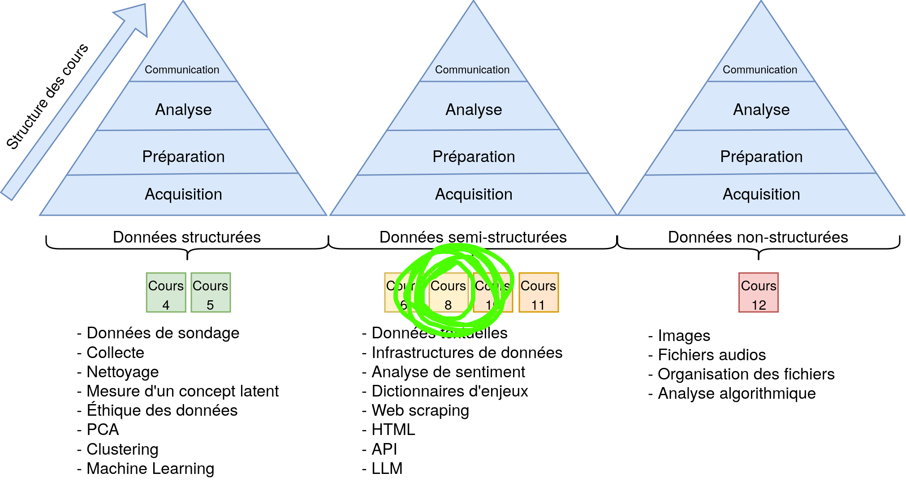
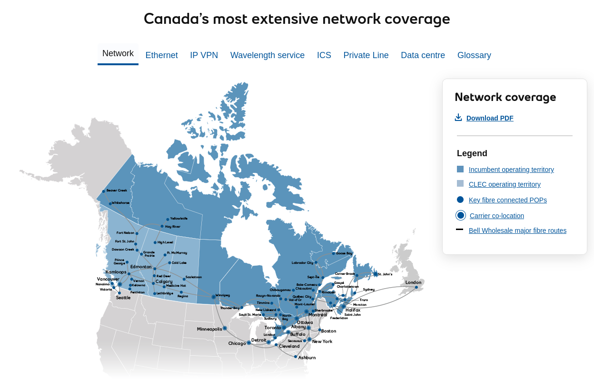
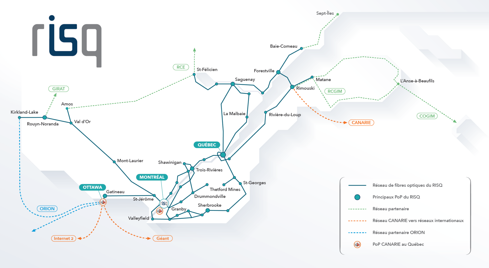
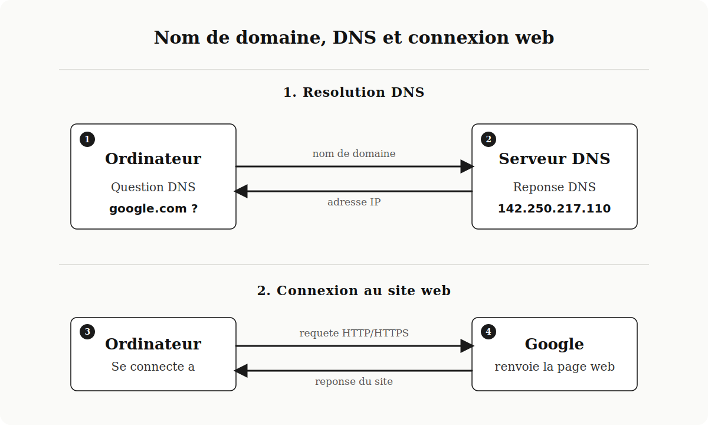
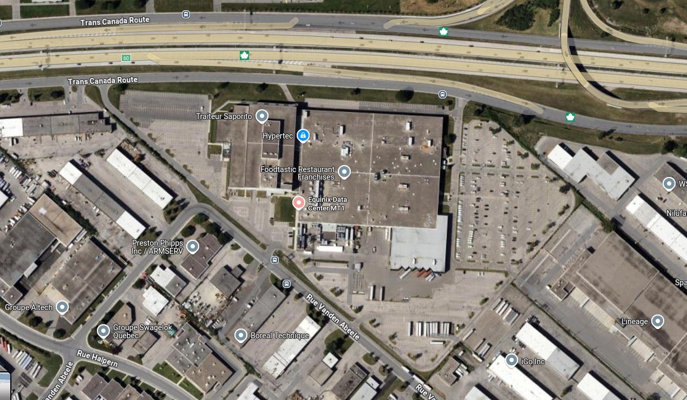
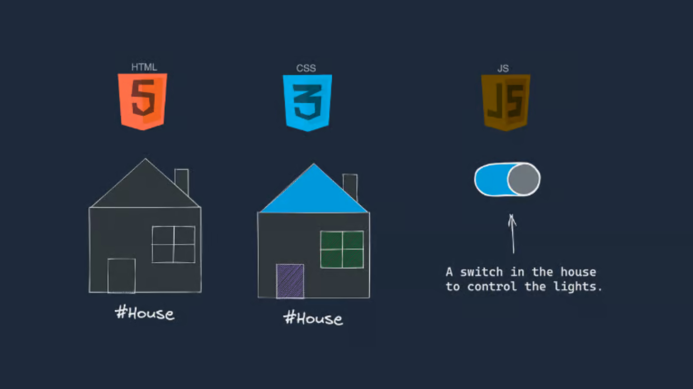
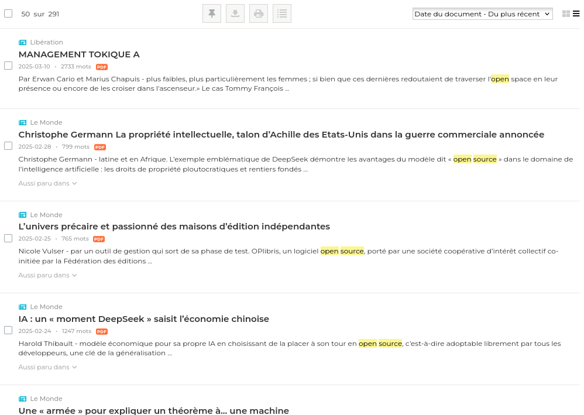
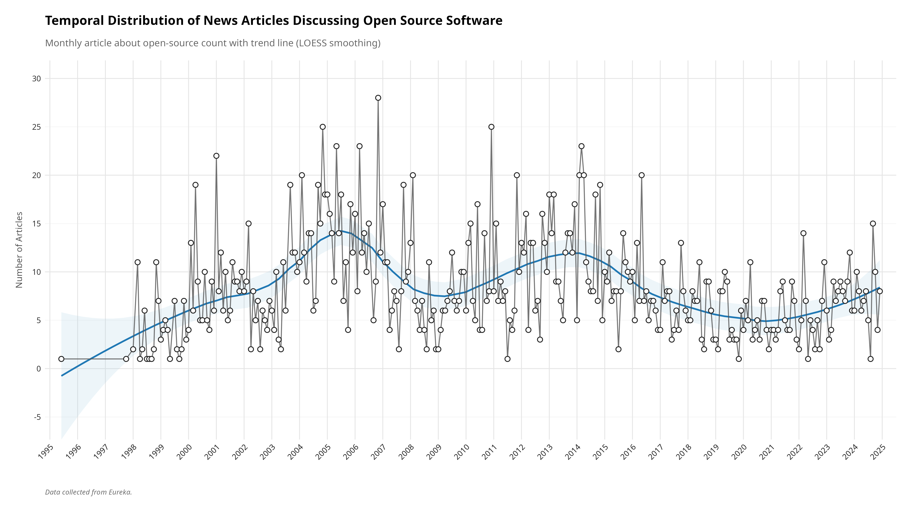
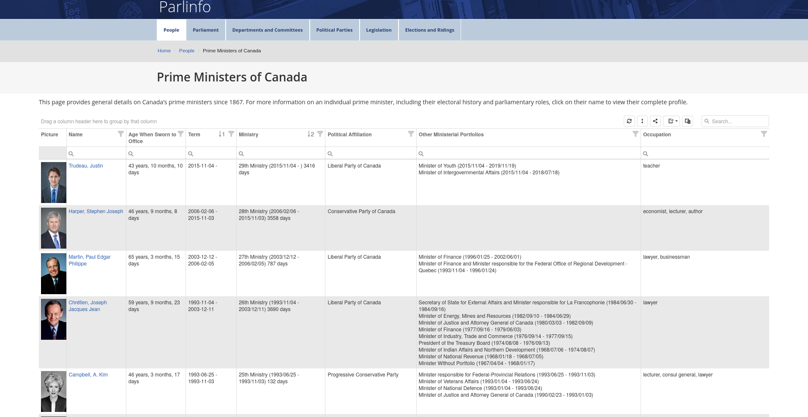
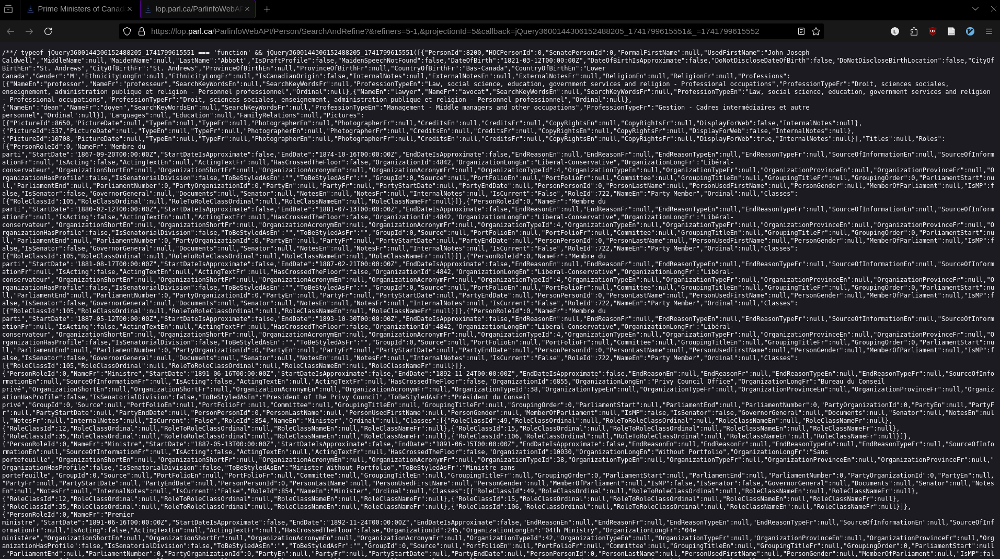

# Retour sur le TP2 

- Difficile ?
- Problèmes de codebook ?
- Questions ?

## Structure du cours

::: {.r-stack}


{.fragment}

:::

## Plan du cours {.smaller}

1. Introduction à Internet
2. Web scraping
3. Exemples concrets

# Internet

## Qu'est-ce qu'Internet ? {.smaller}

:::: {.columns}
::: {.column width="60%"}

### Un réseau de réseaux

- **Interconnexion globale** de réseaux informatiques
- **Échange de données** via des protocoles standardisés
- Inventé dans les années 1960 (ARPANET)
- Devenu public dans les années 1990

### Ce n'est pas le Web

- Internet = l'infrastructure
- Web = un service parmi d'autres (email, FTP, etc.)
:::

::: {.column width="40%"}
{width="100%"}
<p style="font-size: 0.6em; text-align: center;">ARPANET en 1973</p>
:::
::::

## Architecture client-serveur {.smaller}

:::: {.columns}
::: {.column width="40%"}

**Principe fondamental**

- **Client** : demande des ressources
- **Serveur** : fournit des ressources

**Exemples**

- Client : navigateur web, application mobile
- Serveur : ordinateur hébergeant un site web

:::

::: {.column width="50%"}

{width="100%"}

:::
::::

## Réalité physique d'Internet {.smaller}

:::: {.columns}
::: {.column width="60%"}
### Internet est tangible
- Câbles sous-marins traversant les océans
- Fibre optique, cuivre, satellites
- Routeurs et commutateurs
- Serveurs physiques dans des datacenters

### Le "cloud" n'existe pas
- "Le cloud, c'est juste l'ordinateur de quelqu'un d'autre"
- Les données sont stockées physiquement quelque part
:::

::: {.column width="40%"}
{width="100%"}
<p style="font-size: 0.6em; text-align: center;">Carte physique de l'Internet</p>
:::
::::

## {background-image="img/internet_map.jpg"}

## Traceroute vers umontreal.ca

```bash
❯ tcptraceroute umontreal.ca
Selected device wlp3s0, address 192.168.2.71, port 45431 for outgoing packets
Tracing the path to umontreal.ca (132.204.8.144) on TCP port 80 (http), 30 hops max
 1  192.168.2.1  5.618 ms  1.743 ms  2.499 ms
 2  10.11.16.41  3.860 ms  4.041 ms  3.737 ms
 3  * **
 4  64.230.36.102  6.344 ms  7.423 ms  9.020 ms
 5  64.230.91.65  5.214 ms  5.570 ms  6.500 ms
 6  192.77.55.233  6.890 ms  6.169 ms  5.786 ms
 7  imtrl-rq-ic-dmtrl-rq.risq.net (192.77.55.246)  5.837 ms  9.565 ms  7.724 ms
 8  umontreal2-contenu-dmtrl-um.risq.net (132.202.51.145)  32.002 ms  6.428 ms  7.800 ms
 9  * **
10  umontreal2-contenu-membre.risq.net (206.167.253.66)  33.855 ms  8.017 ms  6.263 ms
11  * **
12  * **
13  varnish.ti.umontreal.ca (132.204.8.144) [open]  10.542 ms  9.826 ms  13.408 ms
```

## Le chemin d'une requête web vers UdeM {.smaller}

:::: {.columns}
::: {.column width="50%"}
1. **Votre ordinateur (192.168.2.71)**  
   Point de départ à Québec

2. **Routeur résidentiel (192.168.2.1)** 
   Votre passerelle vers Internet

3. **Routeur Bell Fibe (10.11.16.41)**  
   Entrée dans l'infrastructure de Bell Canada

4. **Dorsale Bell Canada (64.230.36.102)**
   Infrastructure principale de Bell - câbles à haute capacité 
   (jusqu'à 100 Tbps sur certaines lignes)

5. **Point régional Bell (64.230.91.65)**
   Transfert vers Montréal - connexion interurbaine
:::

::: {.column width="50%"}

6. **RISQ - Point d'entrée (192.77.55.233)**
   Entrée dans le Réseau d'Informations Scientifiques du Québec

7. **RISQ - Interconnexion Montréal (192.77.55.246)**
   Routage interne du réseau académique québécois

8. **RISQ - Passerelle UdeM (132.202.51.145)**
   La porte d'entrée spécifique à l'Université de Montréal

9. **UdeM - Réseau membre (206.167.253.66)**
    Transfert au réseau interne de l'UdeM

10. **Serveur Varnish UdeM (132.204.8.144)**
    Destination finale: serveur de cache accélérant la livraison du site
:::
::::

## 



## 



## Infrastructure physique

### Essayez ceci !
Tapez dans votre navigateur: **http://142.250.217.110**  

:::: {.columns}

::: {.column width="50%"}

- Ordinateurs: utilisent des nombres (IP)
- Humains: préfèrent les noms (google.com)
- DNS = l'annuaire qui fait le lien

:::

::: {.column width="50%"}

{width="100%"}

:::
::::

## Empreinte physique des données {.smaller}

:::: {.columns}

::: {.column width="50%"}

### Où sont stockées vos données ?
- Messages Messenger
- Photos Instagram
- Documents Google Drive
- Historique Netflix

### Redondance géographique
- Mêmes données stockées dans plusieurs datacenters
- Protection contre pannes régionales

:::

::: {.column width="50%"}




:::

::::

## Quand vous allez sur un site

:::: {.columns}

::: {.column width="40%"}

1. JavaScript - Le comportement du site
2. HTML - La structure
3. CSS - Le style
4. API - Les données

:::

::: {.column width="60%"}


:::

::::

# Web scraping

## C'est quoi le web scraping ?

**Moissonnage / Aspiration / Grattage** de données sur le Web

:::: {.columns}
::: {.column width="45%"}



:::
::: {.column width="10%"}

➡️  

:::
::: {.column width="45%"}


:::
::::

## 



##


## Révolution numérique

1. Accès exhaustif à d'immenses corpus de documents :
   médias, accords internationaux, discours et procédures parlementaires, rapports annuels
   d'entreprises, jurisprudence, etc.

2. La trace numérique des réseaux sociaux permet l'étude de nombreux phénomènes sociaux

## Étude de cas : Premiers ministres du Canada {.smaller}

::: {.callout-important}
### Question de recherche
**Est-ce que se faire élire jeune est un avantage pour rester premier ministre longtemps ?**

:::

Pour répondre, nous devons recueillir :

- Dates de naissance des premiers ministres
- Leur âge à l'entrée en fonction
- Leur durée au pouvoir
- Analyser la corrélation entre ces variables

## À quel âge Justin Trudeau est entré au pouvoir ? {.smaller}

:::: {.columns}
::: {.column width="60%"}
### Méthode manuelle traditionnelle
1. **Navigateur**: Ouvrir Google
2. **Recherche**: "Justin Trudeau date naissance" + "date entrée fonction"
3. **Sélection**: Choisir une source fiable
4. **Information**: Extraire les dates
5. **Calcul**: Déterminer l'âge
:::

::: {.column width="40%"}
### Résultats
- Né le: **25 décembre 1971**
- Premier mandat: **4 novembre 2015**
- Âge à l'entrée: **43 ans**
:::
::::

## L'inefficacité de l'approche manuelle

::: {.callout-warning}
### Répéter pour CHAQUE premier ministre...

- **Mark Carney**: 1. Rechercher, 2. Sélectionner, 3. Extraire, 4. Calculer, 5. Noter
- **Stephen Harper**: 1. Rechercher, 2. Sélectionner, 3. Extraire, 4. Calculer, 5. Noter
- **Paul Martin**: 1. Rechercher, 2. Sélectionner, 3. Extraire, 4. Calculer, 5. Noter
- **Jean Chrétien**: 1. Rechercher, 2. Sélectionner, 3. Extraire, 4. Calculer, 5. Noter
- **Kim Campbell**: 1. Rechercher, 2. Sélectionner, 3. Extraire, 4. Calculer, 5. Noter

**...et encore 18 autres premiers ministres!** 😓
:::

## Comment approcher le problème?

:::: {.columns}
::: {.column width="25%"}
### 1. Naviguer
Identifier sources et structure des pages
:::

::: {.column width="25%"}
### 2. Aspirer
Télécharger le contenu 
:::

::: {.column width="25%"}
### 3. Extraire
Isoler les données pertinentes
:::

::: {.column width="25%"}
### 4. Nettoyer
Structurer pour l'analyse
:::
::::

> Ces quatre étapes forment le processus standard du web scraping et peuvent être automatisées avec R

## 1. Naviguer

Trouver les données voulues

- Identifier les sources potentielles (sites gouvernementaux)
- Explorer le site du Parlement du Canada
- Déterminer si les données sont accessibles en HTML, JavaScript ou JSON
- Inspecter les requêtes réseau pour trouver des APIs cachées

## 1. Naviguer


## 1. Naviguer


## 1. Naviguer


## 1. Naviguer




## 2. Aspirer - Anatomie d'une URL {.smaller}

::: {.callout-note appearance="minimal"}
`https://www.parlement.ca/premiers-ministres?periode=1950-2020&lang=fr`
:::

:::: {.columns}
::: {.column width="20%"}
**Protocole**
`https://`
*Communication sécurisée*
:::

::: {.column width="30%"}
**Hôte**
`www.parlement.ca`
*Nom d'hôte complet (sous-domaine + domaine)*
:::

::: {.column width="25%"}
**Chemin**
`/premiers-ministres`
*Ressource spécifique*
:::

::: {.column width="25%"}
**Paramètres**
`?periode=1950-2020&lang=fr`
*Filtres et options*
:::
::::

> Comprendre ces composants permet d'identifier quelles parties de l'URL modifier pour accéder aux données souhaitées lors du web scraping

## 1. Naviguer

### Comprendre la structure des pages web

- CTRL + U permet de voir le code source
- Clic droit -> Inspecter <- permet de voir les éléments
- Onglet "Réseau" pour observer les requêtes API

## 2. Aspirer

### Les formats de données

1. HTML : pour les pages web standards
2. JSON : pour les APIs (notre cas)
3. JavaScript : pour les pages dynamiques

## 2. Aspirer

```r
# URL of the page to scrape
url <- "https://lop.parl.ca/sites/ParlInfo/default/en_CA/People/primeMinisters"

# Read the webpage
page <- xml2::read_html(url)

elem <- rvest::html_table(page, "table.dx-datagrid-table")
```

### Ça ne fonctionne pas ? Pourquoi ?

➡️  Retour sur le site web !

## 2. Aspirer

### Ctrl + U

Permet de voir que le tableau n'est pas visible dans la page

### Onglet Réseau


##



## 2. Aspirer

::: {.callout-tip}
Dans notre cas, nous avons découvert une API du Parlement du Canada !
:::

```r
api_url <- "https://lop.parl.ca/parlinfoWebAPI/Person/GetPrimeMinisters"

response <- httr::GET(api_url)
content <- httr::content(response, "text", encoding = "UTF-8")
```

::: {.callout-note}
Les API sont souvent masquées, mais peuvent être découvertes en inspectant les requêtes réseau !
:::

## 2. Aspirer

::: {.callout-warning}
### Petit rappel méthodologique
Un script de scraping peut cesser de fonctionner même si:

- `robots.txt` autorise toujours l'accès
- l'URL existe encore
- la structure générale du site semble identique

Pourquoi? Parce que les serveurs changent aussi leurs mécanismes anti-bot.
:::

## 2. Aspirer

```r
api_url <- "https://lop.parl.ca/parlinfoWebAPI/Person/GetPrimeMinisters"

response <- httr::GET(api_url)
content <- httr::content(response, "text", encoding = "UTF-8")
```

::: {.callout-important}

Vous voyez? L'an dernier, ca passait. Aujourd'hui, non.

Ce n'est pas `robots.txt` qui nous bloque ici.

Le probleme, c'est qu'une requete trop "nue" ressemble maintenant davantage a un robot qu'a un navigateur.
:::

## 2. Aspirer

```r
# On modifie donc notre approche.
# On garde le meme site, mais on envoie plus d'information au serveur
# pour que notre requete ressemble a celle d'un navigateur ordinaire.
api_url <- "https://lop.parl.ca/parlinfoWebAPI/Person/GetPrimeMinisters"

response <- httr::GET(
  api_url,
  httr::add_headers(
    "Accept" = "application/json, text/javascript, */*; q=0.01",
    "Referer" = "https://lop.parl.ca/sites/ParlInfo/default/en_CA/People/primeMinisters",
    "X-Requested-With" = "XMLHttpRequest"
  ),
  httr::user_agent(
    "Mozilla/5.0 (X11; Linux x86_64) AppleWebKit/537.36 (KHTML, like Gecko) Chrome/134.0.0.0 Safari/537.36"
  )
)

httr::stop_for_status(response)
content <- httr::content(response, "text", encoding = "UTF-8")
```

## 3. Extraire

### JSON vs HTML

Pour le HTML : `library(rvest)` et `library(xml2)`

Pour le JSON (notre cas) :
```r
# Maintenant, la reponse valide est du JSON direct.
jsonlite::validate(content)

# Conversion du JSON en objet R
pm_data <- jsonlite::fromJSON(content)
```

## 3. Extraire {.smaller}

### Structure JSON

`json$premiers_ministres$details$parti$nom`

```json
{
  "premiers_ministres": [
    {
      "nom": "Justin Trudeau",
      "details": {
        "naissance": "1971-12-25",
        "parti": {
          "nom": "Libéral",
          "couleur": "rouge"
        }
      },
    },
    {
      "nom": "Stephen Harper",
      "details": {
        "naissance": "1959-04-30",
        "parti": {
          "nom": "Conservateur",
          "couleur": "bleu"
        }
      },
    }
  ],
}
```

## 3. Extraire

### Traitement des données JSON

```r
# Création d'un dataframe avec les informations principales
df_pm <- data.frame(
  name = paste(pm_data$UsedFirstName, pm_data$LastName),
  yob = pm_data$DateOfBirth,                  # Date de naissance
  Party = pm_data$PartyEn,                    # Parti politique
  occupation = pm_data$ProfessionsEn,         # Profession
  stringsAsFactors = FALSE
)
```

## 3. Extraire

### Naviguer dans les structures JSON complexes

```r
start_date <- c()
end_date <- c()
# Parcourir chaque premier ministre pour extraire les dates de mandat
for (i in 1:nrow(pm_data)) {
  # Récupérer tous les rôles politiques de la personne
  roles <- pm_data$Roles[[i]]
  
  # Parcourir chaque rôle pour trouver "Premier ministre"
  for (j in 1:nrow(roles)) {
    # Vérifier si le titre inclut "Premier ministre"
    if ("Premier ministre" %in% roles$NameFr) {
      # Enregistrer les dates de début et fin
      start_date[i] <- roles$StartDate[j]
      end_date[i] <- roles$EndDate[j]
    }
  }
}
```

## 4. Nettoyer

### Préparation pour l'analyse

```r
# Conversion des dates en format Date de R
df_pm$start_date <- as.Date(substr(start_date, 1, 10))
df_pm$end_date <- as.Date(substr(end_date, 1, 10))
df_pm$yob <- as.Date(substr(df_pm$yob, 1, 10))

# Calcul de variables d'intérêt
df_pm$duration <- as.numeric(difftime(df_pm$end_date, 
                                     df_pm$start_date, 
                                     units = "days"))/365.25

df_pm$age_at_start <- as.numeric(difftime(df_pm$start_date, 
                                         df_pm$yob, 
                                         units = "days"))/365.25
```

## 5. Visualiser et analyser

### Création d'un graphique

```r
# Visualisation avec ggplot2
ggplot2::ggplot(df_pm, ggplot2::aes(x = age_at_start)) +
  ggplot2::geom_histogram(binwidth = 5, fill = "#CF0E20") +
  ggplot2::labs(
    title = "Âge des premiers ministres canadiens à leur entrée en fonction",
    x = "Âge au début du mandat (années)",
    y = "Fréquence"
  )
```

## 5. Visualiser et analyser


## 5. Visualiser et analyser {.smaller}

### Analyse statistique

```r
# Régression linéaire: durée ~ âge au début
model <- lm(duration ~ age_at_start, data = df_pm)
summary(model)
```
```txt
r$> summary(m)

Call:
lm(formula = duration ~ age_at_start, data = df_pm)

Coefficients:
             Estimate Std. Error t value Pr(>|t|)
age_at_start -0.05162    0.09679  -0.533    0.599

Residual standard error: 4.515 on 21 degrees of freedom
Multiple R-squared:  0.01336,   Adjusted R-squared:  -0.03362 
F-statistic: 0.2845 on 1 and 21 DF,  p-value: 0.5994
```

::: {.callout-important}
Est-ce que les plus jeunes premiers ministres ont tendance à rester plus longtemps en poste ? NON !
:::

# Exemples concrets

## Agrégateur de sondages électoraux

### Les trois approches principales du Web Scraping {.smaller}

1. Extraction des tableaux HTML/CSS (`rvest`)
2. Téléchargement direct de fichiers (CSV, Excel)
3. Connexion aux API REST (`httr`, `jsonlite`)

## Notre projet : Agrégateur de sondages électoraux {.smaller}

### Trois sources de données électorales canadiennes :

1. **338Canada** : tables HTML avec projections électorales
2. **Poliwave** : téléchargement direct de fichiers Excel
3. **The Signal** : API REST (endpoints JSON)

### Structure du pipeline de données :
- Extraction → Stockage brut → Transformation → Visualisation

## Agrégateur de Sondages Électoraux - Objectif {.smaller}

Pour chaque méthode de scraping, nous verrons :

1. Les packages et fonctions clés
2. Le code étape par étape 
3. Les avantages et inconvénients

# 1. Web Scraping avec HTML/CSS {background-color="#4A235A" .center}

## Canada 338 {.smaller}

### Le site Canada 338

- Présente des projections électorales par circonscription
- Les données sont organisées dans un tableau HTML
- Identifié par l'ID CSS `#myTable`

### Notre approche

1. Charger la page principale
2. Extraire le tableau HTML des projections
3. Nettoyer et structurer les données
4. Sauvegarder en format RDS pour analyse ultérieure

## Canada 338

```r
# Chargement des packages nécessaires
library(rvest)     # Pour le scraping HTML
library(dplyr)     # Pour la manipulation de données
library(stringr)   # Pour la manipulation de texte

# 1. URL de la page à scraper
url <- "https://338canada.com/districts.htm"

# 2. Lecture de la page web
html_content <- read_html(url)

# 3. Extraction du tableau HTML
table_data <- html_content %>%
  html_node("#myTable") %>%     # Sélectionne le tableau par son ID CSS
  html_table(fill = TRUE)       # Convertit en dataframe

```

## Canada 338 {.smaller}

```r
# 4. Extraction des informations utiles
# 4.1 Extraire l'ID de circonscription (format 12345)
table_data$riding_id <- str_extract(table_data$electoral_district, "\\d{5}")

# 4.2 Extraire le nom propre de la circonscription
table_data$district_name <- str_replace_all(table_data$electoral_district, "\\d{5} ", "")

# 4.3 Extraire le parti projeté gagnant (LPC, CPC, NDP, BQ, GPC)
table_data$projected_party <- str_extract(table_data$latest_projection, "(LPC|CPC|NDP|BQ|GPC)")

# 4.4 Extraire le statut de la projection (safe, likely, leaning)
table_data$projection_status <- str_replace_all(table_data$latest_projection, "(LPC|CPC|NDP|BQ|GPC) ", "")

# 5. Création d'un dataframe propre et sauvegarde
clean_data <- table_data %>%
  select(riding_id, district_name, projected_party, projection_status) %>%
  filter(!is.na(riding_id))  # Supprime les lignes sans ID (entêtes)

# 6. Ajout de la date du scraping et sauvegarde
clean_data$scrape_date <- Sys.Date()
saveRDS(clean_data, "data/lake/can338/338_canada_projection.rds")
```

## 338Canada - Comment trouver les bons sélecteurs CSS? {.smaller}

:::: {.columns}

::: {.column width="50%"}

**Outils du navigateur**

1. Clic droit sur l'élément → Inspecter
2. Explorer l'arbre HTML
3. Identifier les balises et attributs uniques

**Stratégies pour les tableaux**

- Trouver l'ID du tableau: `#myTable`
- Sélectionner par position: `table:nth-child(2)`
- Par classe: `.data-table`
- Combinaison: `div.content table`

:::

::: {.column width="50%"}

**La fonction html_table()**

- Convertit un tableau HTML directement en dataframe
- Option `fill = TRUE` pour les tableaux irréguliers
- Préserve la structure des colonnes

:::

::::

## 338Canada - Avantages et inconvénients {.smaller}

### Inconvénients
- Dépendance à la structure HTML du site
- Sensible aux modifications de mise en page
- Traitement supplémentaire souvent nécessaire
- Limitations pour les tableaux dynamiques (JavaScript)

### Considérations
- Vérifier la stabilité du tableau dans le temps
- Prévoir un plan B si la structure change
- Ajouter la date d'extraction pour traçabilité
- Implémenter des vérifications de validité

# 2. Téléchargement direct de fichiers {background-color="#0B5345" .center}

## Poliwave - Notre objectif {.smaller}

### Le site Poliwave
- Publie des projections électorales pour le Canada
- Fournit un fichier Excel avec les données par circonscription
- URL directe : https://www.poliwave.com/Canada/Federal/Data/CAtable.xlsx

### Notre approche
C'est très simple : télécharger directement le fichier Excel et le sauvegarder !

## Poliwave {.smaller}

```r
# Chargement du package pour Excel
library(readxl)

# 1. Création d'un fichier temporaire avec extension .xlsx
temp_file <- tempfile(fileext = ".xlsx")

# 2. Téléchargement du fichier
download.file(
  "https://www.poliwave.com/Canada/Federal/Data/CAtable.xlsx", 
  temp_file, 
  mode = "wb"  # Mode binaire important pour Excel
)

# 3. Lecture du fichier Excel
poliwave_ridings <- readxl::read_xlsx(temp_file)

# 4. Sauvegarde en format RDS
saveRDS(
  poliwave_ridings,
  "data/lake/poliwave/poliwave_table.rds"
)
```

## Poliwave - Avantages et inconvénients {.smaller}

:::: {.columns}
::: {.column width="50%"}
### Avantages
- Aucun parsing ou nettoyage nécessaire
- Très robuste aux changements du site
- Les données sont déjà structurées
- Performance optimale (téléchargement direct)

### Cas d'usage idéaux
- Sites qui proposent des exports directs
- Besoin des données complètes
- Absence de filtrage nécessaire
- Mises à jour régulières des fichiers
:::

::: {.column width="50%"}
### Inconvénients
- Limité aux données explicitement partagées
- Pas de personnalisation possible
- Format imposé par la source
- Dépendance aux modifications d'URL
- Fichiers volumineux potentiels

### Considérations
- Vérifier régulièrement que l'URL est valide
- S'assurer que le format de fichier reste stable
- Prévoir une gestion des erreurs de téléchargement
- Documenter la structure attendue du fichier
:::
::::

# 3. API REST avec httr & jsonlite {background-color="#17202A" .center}

## API REST - Les packages {.smaller}

| Package | Fonction | Description |
|---------|----------|-------------|
| `httr` | `GET()` | Effectue une requête HTTP GET à une URL |
| `httr` | `content()` | Extrait le contenu d'une réponse HTTP |
| `jsonlite` | `fromJSON()` | Parse une chaîne JSON en objet R |

## The Signal - Notre objectif {.smaller}

### Le site The Signal
- Publie des projections électorales développées par CBC/Radio-Canada
- API cachée pour accéder aux données
- Structure des données en format JSON

### Notre approche
1. Définir l'URL de l'API
2. Effectuer une requête GET à l'endpoint
3. Parser la réponse JSON en dataframe
4. Sauvegarder les résultats


## The Signal {.smaller}

```r
# Chargement des packages
library(dplyr)    # Pour la manipulation de données
library(httr)     # Pour les requêtes HTTP
library(jsonlite) # Pour le parsing JSON

# 1. Configuration de base
# URL de l'API pour les projections électorales
api <- "https://thesignal-api.voxpoplabs.com/api/en/canada2025/riding_projections"

# 4. Exécution de la requête API
response <- httr::GET(api)
```

## The Signal {.smaller}

```r
# 5. Extraction du texte JSON
json_text <- httr::content(response, as = "text", encoding = "UTF-8")

# 6. Conversion du JSON en dataframe
riding_data <- jsonlite::fromJSON(json_text)

# 9. Sauvegarde des résultats
saveRDS(riding_data, "data/lake/signal_riding_projections.rds")
```

## Structure de réponse JSON {.smaller}

```json
{
  "ridings": [
    {
      "riding_name": "Beauce",
      "region": "QC",
      "confidence": "Likely",
      "prediction": "CON",
      "date_updated": "2023-11-15"
    },
    {
      "riding_name": "Toronto Centre",
      "region": "ON",
      "confidence": "Safe",
      "prediction": "LIB",
      "date_updated": "2023-11-15"
    },
    {
      "riding_name": "Vancouver Centre",
      "region": "BC",
      "confidence": "Likely",
      "prediction": "LIB",
      "date_updated": "2023-11-15"
    }
  ],
  "meta": {
    "last_updated": "2023-11-15T12:00:00Z",
    "version": "1.0"
  }
}
```

## The Signal - Avantages et inconvénients {.smaller}

:::: {.columns}
::: {.column width="50%"}
### Avantages
- Facile à extraire

### Cas d'usage idéaux
- Sites avec API publique
- Besoins de données spécifiques
:::

::: {.column width="50%"}
### Inconvénients
- Quotas de requêtes possibles
- Dépendance aux changements d'API

### Considérations
- Vérifier les conditions d'utilisation
- Respecter les limites de taux
:::
::::

## Quand utiliser quelle approche? {.smaller}

### On fait avec ce qu'on a !

## Robots.txt - Qu'est-ce que c'est ? {.smaller}

:::: {.columns}
::: {.column width="65%"}
- Fichier texte placé à la racine d'un site web
- Indique aux robots d'indexation et scrapers quelles parties du site :
  - **Peuvent** être visitées et indexées
  - **Ne doivent pas** être visitées
- Standard de facto depuis 1994
- Respecté par les moteurs de recherche et autres robots "éthiques"
:::

::: {.column width="35%"}
```
User-agent: *
Disallow: /private/
Disallow: /admin/
Allow: /public/

User-agent: Googlebot
Allow: /
```
:::
::::

> Un guide pour les robots, mais pas une barrière de sécurité

## Pourquoi respecter robots.txt ? {.smaller}

::: {.callout-important}
### Éthique du web scraping
- **Respect des ressources** du serveur
- **Politesse numérique** envers les propriétaires du site
- **Conformité légale** (selon les juridictions)
:::

:::: {.columns}
::: {.column width="50%"}
### Conséquences possibles
- Bannissement de votre adresse IP
- Surcharge des serveurs
- Problèmes légaux potentiels
:::

::: {.column width="50%"}
### Alternatives légitimes
- Utiliser les API officielles quand disponibles
- Limiter la fréquence des requêtes
- Contacter le propriétaire du site
:::
::::
## Vérifier robots.txt en R {.smaller}

::: {.callout-note}
### La règle générale : toujours vérifier avant de scraper !
:::

```r
# Installer le package si nécessaire
# install.packages("robotstxt")
library(robotstxt)

# Vérifier si le scraping est autorisé
paths_allowed("https://lop.parl.ca/sites/ParlInfo/default/en_CA/People/primeMinisters")
#> [1] TRUE

paths_allowed("https://lop.parl.ca/parlinfoWebAPI/Person/GetPrimeMinisters")
#> [1] TRUE

# Examiner le fichier robots.txt complet
robotstxt::get_robotstxt("https://lop.parl.ca")
```

> Le package `robotstxt` facilite la vérification avant le web scraping

> Important: `robots.txt` dit si l'accès est permis, pas si une requête minimale sera acceptée techniquement par le serveur.

## robots.txt

```txt
r$> robotstxt::get_robotstxt("https://lop.parl.ca")
[robots.txt]
--------------------------------------

User-agent: *
Disallow: /staticfiles/PublicWebsite/Home/About/CoporateDocuments/PDFExc
ludedInRobotsTXT
Disallow: /content/lop/Quorum
Disallow: /Content/LOP/Quorum
Disallow: /Content/LOP/quorum
Disallow: /Content/lop/quorum
Disallow: /content/lop/quorum
Disallow: /content/LOP/Quorum
Disallow: /sites/PublicWebsite/default/en_CA/NotFound
Disallow: /sites/PublicWebsite/default/fr_CA/NotFound
Disallow: /sites/ParlInfo/default/en_CA/SiteInformation/parlinfoMoved
Disallow: /sites/ParlInfo/default/fr_CA/InformationSite/parlinfoDemenage
Allow: /sites/ParlInfo/default/en_CA/People/Profile?*
Disallow: /sites/ParlInfo/default/en_CA/People/Profile
Allow: /sites/ParlInfo/default/fr_CA/Personnes/Profil?*
Allow: /sites/ParlInfo/default/fr_CA/Personnes/Profile?*
Disallow: /sites/ParlInfo/default/fr_CA/Personnes/Profil
Disallow: /sites/ParlInfo/default/fr_CA/Personnes/Profile
Allow: /sites/ParlInfo/default/en_CA/Federal/areasResponsibility/profile
?*
Disallow: /sites/ParlInfo/default/en_CA/Federal/areasResponsibility/prof
ile
Allow: /sites/ParlInfo/default/fr_CA/Federal/domainesResponsabilites/pro
fil?*
Disallow: /sites/ParlInfo/default/fr_CA/Federal/domainesResponsabilites/
profil
Allow: /sites/ParlInfo/default/en_CA/Parties/Profile?*
Disallow: /sites/ParlInfo/default/en_CA/Parties/Profile
Allow: /sites/ParlInfo/default/fr_CA/Partis/Profil?*
Disallow: /sites/ParlInfo/default/fr_CA/Partis/Profil
Allow: /sites/ParlInfo/default/en_CA/ElectionsRidings/Ridings/Profile?*
Disallow: /sites/ParlInfo/default/en_CA/ElectionsRidings/Ridings/Profile
Allow: /sites/ParlInfo/default/fr_CA/ElectionsCirconscriptions/Circonscr
iptions/Profil?*
Disallow: /sites/ParlInfo/default/fr_CA/ElectionsCirconscriptions/Circon
scriptions/Profil
Allow: /sites/ParlInfo/default/en_CA/ElectionsRidings/Elections/Profile?
*
Disallow: /sites/ParlInfo/default/en_CA/ElectionsRidings/Elections/Profi
le
Allow: /sites/ParlInfo/default/fr_CA/ElectionsCirconscriptions/Elections
/Profil?*
Disallow: /sites/ParlInfo/default/fr_CA/ElectionsCirconscriptions/Electi
ons/Profil
Disallow: /sites/PublicWebsite/default/fr_CA/Staging
Disallow: /sites/PublicWebsite/default/en_CA/Staging
Disallow: /sites/PublicWebsite/default/fr_CA/merc
Disallow: /sites/PublicWebsite/default/en_CA/merc
Sitemap: https://bdp.parl.ca/rss/public/fr/sitemapxml
Sitemap: https://lop.parl.ca/rss/public/en/sitemapxml
```

## Lire et interpréter robots.txt {.smaller}

:::: {.columns}
::: {.column width="50%"}
### Syntaxe courante

- `User-agent: *` - S'applique à tous les robots
- `User-agent: Googlebot` - Spécifique à Google
- `Disallow: /dossier/` - Interdit l'accès
- `Allow: /dossier/` - Autorise explicitement l'accès
- `Crawl-delay: 10` - Attendre 10 secondes entre requêtes
:::

::: {.column width="50%"}
### Limitations

- Basé sur la confiance, pas une protection technique
- Interprétation parfois ambiguë
- Certains sites utilisent des règles complexes
- Pas de norme officielle pour "User-agent: R-Scraper"
:::
::::

> Toujours associer la vérification de robots.txt à d'autres bonnes pratiques de scraping (délais, user-agent explicite, etc.)

## Bonnes pratiques au-delà de robots.txt {.smaller}

:::: {.columns}
::: {.column width="50%"}
### Identifiez-vous
```r
session <- polite::bow(
  url = "https://example.com",
  user_agent = "POL2000 Educational Scraper"
)
```
:::

::: {.column width="50%"}
### Respectez les délais
```r
# Attendre entre les requêtes
Sys.sleep(2)  

# Ou utilisez polite
polite::scrape(session)
```
:::

::::

::: {.callout-tip}
Le package `polite` intègre la vérification de robots.txt et d'autres bonnes pratiques comme les délais entre requêtes.
:::

## Pour aller plus loin {.smaller}

- `RSelenium` : pour les sites dynamiques (JavaScript)

## Trucs et astuces {.smaller}

1. Utiliser les outils de développement de votre navigateur
2. Soyez conscients des implications éthiques (robots.txt & Sys.sleep(1))
3. Les tables HTML peuvent être importées directement dans R
4. Utiliser les regex
5. Peaufiner vos compétences en CSS
6. Utiliser les API officielles si possible
7. Des sites peuvent être visités avec la Wayback Machine
8. Repérez les API cachées dans les sites web
9. Utiliser Selenium : pour les utilisateurs avancés

# À la semaine prochaine !
