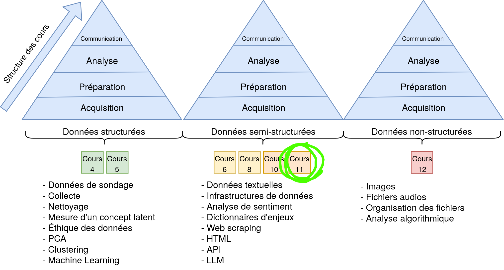
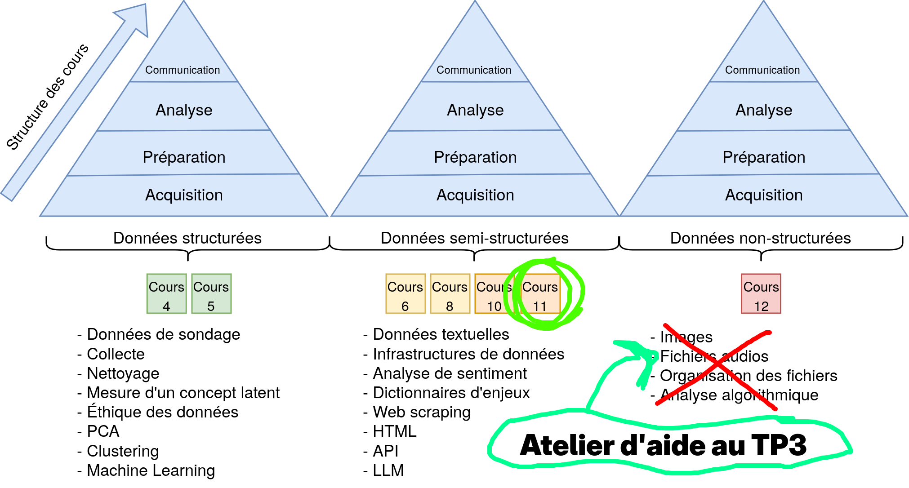
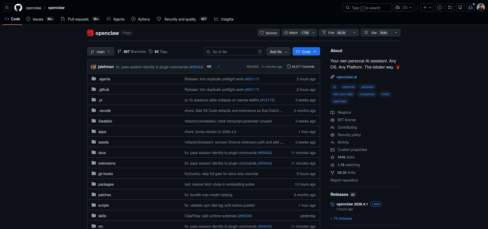
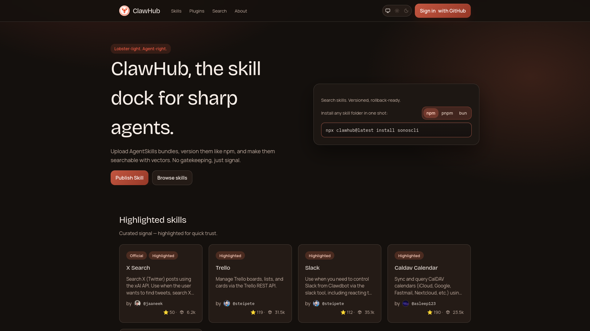
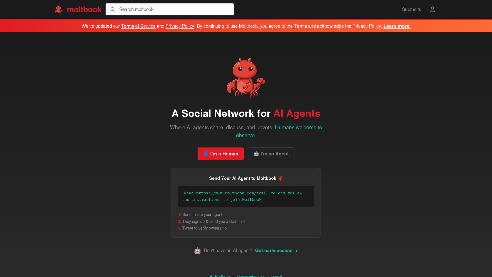

## Structure du cours

## Structure du cours

## Structure du cours

## TP 3

{.absolute top=250 right=150}

## {background-image="img/llm_text.png"}

# IA agentique

## C'est quoi un agent ?

::: {.r-stack}

{.absolute top=320 right=800 .fragment}

{.absolute top=350 right=-100 .fragment}

{.absolute top=-100 right=-200 style="transform: rotate(-180deg);" width="40%" .fragment}

:::

## C'est quoi un agent ?

::: {.r-stack}

{.absolute top=200 right=-100 .fragment}

{.absolute top=250 right=600 .fragment width="70%"}

:::

## C'est quoi un agent ?

Un agent est une entité autonome mandatée pour agir dans le monde afin de produire un effet au nom d'un objectif ou d'un mandant.

- **La délégation**

- **L'autonomie**

- **L'effectivité** 

## Donc ?

L'IA Agentique est une façon de faire accomplir des actions  un LLM

### Comment ? 

Les LLM ne font que générer du texte ?

## Donc ?

L'IA Agentique est une façon de faire accomplir des actions  un LLM

### Comment ?

## LLM - Génération de texte

## LLM - Faire des actions

## Les outils

::::{.columns}

:::{.column width="50%"}

### Terminal

- Claude Code
- Codex
- Gemini-cli
- OpenCode
- Crush

:::

:::{.column width="50%"}

### IDE/UI

- Cursor
- GitHub Copilot
- Claude Desktop / Cowork
- Etc. 

:::

::::

# MCP

::: {.r-stack}

{.absolute top=320 right=800 .fragment}

{.absolute top=350 right=400 .fragment}

{.absolute top=200 right=300 .fragment}

{.absolute top=-100 right=200 .fragment}

{.absolute top=100 right=600}

:::

## C'est quoi un MCP ? {background="black"}

{.absolute top=200 right=100 width="110%"}

# 

## 

##

##

## 

## Qu'est-ce qu'on fait avec des agents ?

- La collecte de données automatisée 

- Le nettoyage de données (Tidy Data) 

- La simulation de données sociales ?

- Avez vous des idées ?

# Installer OpenClaw ?
